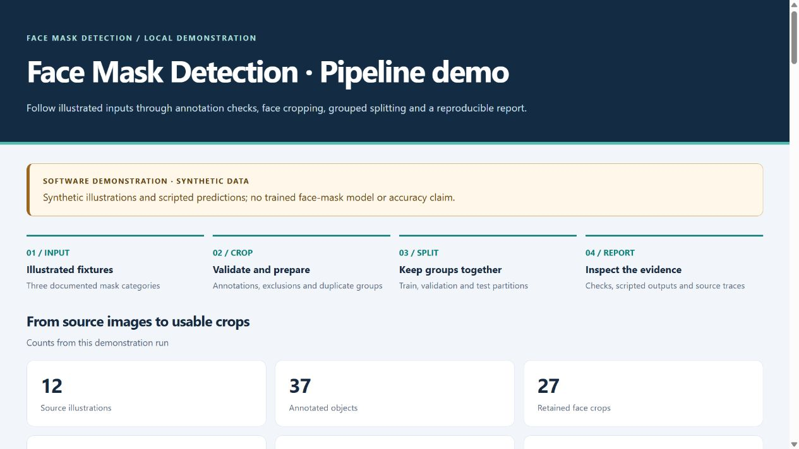
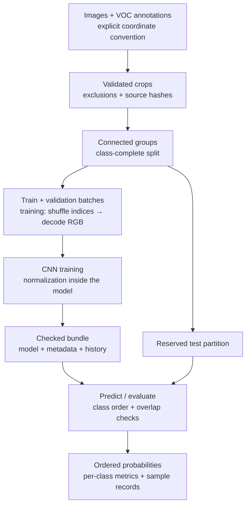
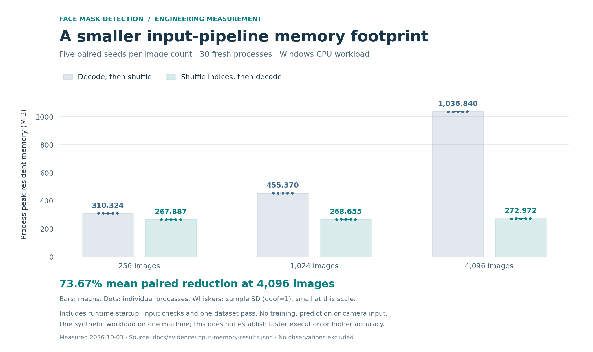

# Face Mask Detection

I started this project during COVID-19, using Python, Kaggle images and a
face-detection library to explore a simple idea: find a face, then classify
whether it is wearing a mask. The original project received a **Commendation
at the 2022 Coding Lab International Coding Competition**, as recorded in its
earlier README.

Revisiting that experiment shifted my focus to the engineering around a model:
how annotations become crops, how related images stay together, and how a saved
prediction retains the meaning of its classes. The current pipeline supports
**mask worn**, **no mask**, and **mask worn incorrectly**, while retaining
compatibility with the maintained two-class implementation.

[Try the demo](#try-the-software-demo) · [Design decisions](#engineering-decisions) ·
[Memory experiment](#measured-input-pipeline-memory) ·
[Research workflow](docs/research-workflow.md) · [Project history](docs/project-history.md)

## How the project evolved

| Stage | Focus |
|---|---|
| Original COVID-era experiment | Learning image classification with Python, Kaggle images and a face-detection library; the 2022 Commendation belongs to this project history |
| Maintained binary implementation | Grouped splitting, model metadata, camera-free inference and automated tests were already present |
| Current revision | Three-category classification, explicit annotation coordinates, traceable exclusions, stronger split and bundle checks, a lighter input pipeline and a reproducible software demo |

The [history record](docs/project-history.md) links these stages to the preserved
starting commit. The present evidence concerns software behaviour and input
memory; real three-category accuracy and camera reliability remain unmeasured.

## Try the software demo

From a source checkout, with Python 3.11–3.13:

```powershell
python demo.py
```

The launcher uses a compatible Pillow 12.0.0 installation or sets up an isolated
environment. First setup needs internet unless a local wheel is supplied. It
does not require TensorFlow, a camera, a dataset download or trained weights.

Open the printed `report.html` path to explore the generated report. The included
illustrations exercise the **actual preparation, grouped splitting and reporting
code**; the probability vectors are scripted fixtures, not model predictions.
The confusion matrix demonstrates reporting functionality, not classifier accuracy.

```text
12 source images → 27 retained crops
1 duplicate group · 2 conflicting sources quarantined · 1 invalid box excluded
train=21 · validation=3 · test=3
6/6 pipeline checks passed
```



Every run uses a new output directory. The report embeds its illustrations and
needs no server or remote assets. See the [demo guide](docs/demo.md) for offline
setup, expected output, gallery filters and failure handling.

## Engineering decisions

| Boundary | Decision | Why it matters |
|---|---|---|
| Annotation → crop | Require the coordinate convention; validate boxes and record exclusions | A one-pixel convention error can affect every crop. Reviewable receipts preserve the original and effective boxes |
| Crop → partition | Join declared relationships and exact duplicates into connected groups | Related samples stay together; every partition must cover all classes, or splitting fails with an explanation |
| Image → tensor | Share RGB, resizing and numeric-range contracts across file and camera input | Training and prediction agree on channel meaning; camera overlays cannot alter a later crop |
| Training → saved model | Validate a complete bundle of model, metadata, history and hashes | Ordered classes and provenance travel with the weights instead of relying on loose files |
| Dataset → batch | Shuffle integer indices before decoding images | Full-dataset shuffling no longer requires a buffer of decoded float32 images |
| Prediction → report | Retain sample identities, class order and complete probability vectors | Reports can check alignment and distinguish undefined metrics from zero values |

These choices have limits. Source-image groups are not verified person
identities; known person/session relationships must be supplied. Exact hashes
miss transformed duplicates. Class-complete splitting uses a bounded search,
so an exhausted search does not prove that a feasible split is impossible.
Bundle checks detect drift and ordinary failures, not every power-loss scenario.

## From annotations to an inspectable result



The lightweight demo reuses preparation, splitting and metric functions, then
supplies scripted probabilities instead of training a CNN. For real training,
the [research workflow](docs/research-workflow.md) covers dataset prerequisites,
the optional camera adapter and evaluation on the reserved test partition.

The CNN rescales 128×128 RGB input, uses four convolution/pooling blocks, then
global average pooling, dropout and a 128-unit dense layer. The categorical head
uses softmax; the legacy binary head uses a single sigmoid output. See the
[model schematic](docs/visuals/cnn-architecture.png) and
[shared input contract](docs/visuals/input-contract.png).

Source labels retain their documented spelling and order:
`mask_weared_incorrect`, `with_mask`, `without_mask`. Categorical prediction uses
argmax, with ties resolved to the lowest recorded index. These probabilities
are not calibrated confidence guarantees.

## Measured input-pipeline memory

At **4,096 synthetic images**, mean process peak resident memory decreased from
**1,036.840 MiB to 272.972 MiB**: a **73.67% mean paired reduction across five
seeds**. The complete experiment used 30 fresh processes across three dataset
sizes on one Windows machine, retaining every observation.



| Synthetic images | Preserved baseline, MiB | Revised pipeline, MiB | Mean paired reduction |
|---:|---:|---:|---:|
| 256 | 310.324 ± 0.149 | 267.887 ± 0.142 | 13.67% |
| 1,024 | 455.370 ± 0.364 | 268.655 ± 0.296 | 41.00% |
| 4,096 | 1,036.840 ± 0.581 | 272.972 ± 0.330 | **73.67%** |

Values are mean ± sample SD. Percentage reductions are calculated within each
matched seed before averaging. The benchmark compares the real input-pipeline
implementations using their shared binary mode; it does not compare classifier
quality. Process peaks include Python/TensorFlow startup, input verification,
one shuffled pass and output checks.

The result supports lower **input-pipeline process memory on this workload**.
It does not establish reduced training memory, faster execution or better
classification accuracy. Index and manifest storage still grow with the dataset.
The [full results](docs/measurement-results.md),
[portable observations](docs/evidence/input-memory-results.json) and
[reproduction protocol](docs/measurement.md) explain the conditions and limits.

## Tests and verification

The latest complete Windows/Python 3.12 suite collected **157 tests: 156 passed
and one Windows-specific symlink test skipped**. Combined statement/branch
package coverage was **89.39%**. This run includes all 15 launcher tests and
the synthetic TensorFlow integrations; separate earlier runs are not added to
that count. The [dated local verification record](docs/evidence/integration-verification.json)
records the tested source and environment.

Tests target meaningful failure boundaries: a brute-force split oracle,
hand-checked probability metrics, mismatched model/data identities, filesystem
failure injection, RGB/BGR parity and fake-camera cleanup. Synthetic TensorFlow
tests train, save, reload, predict and evaluate without using face data.

The [CI workflow](.github/workflows/python.yml) checks core Python 3.11–3.13
contracts and synthetic Python 3.12 runtime behaviour on Ubuntu and Windows,
with an 85% package coverage floor. A separate job builds the source distribution,
verifies its contents and runs the demo from the extracted archive. See the
[testing guide](docs/testing.md) for commands and measurement scope, and
[GitHub Actions](https://github.com/IGoByLotsOfNames/face-mask-detection/actions)
for results associated with a particular commit.

## What remains to be measured

Before a real-data study, the historical corpus's provenance, data rights and
coordinate convention need to be resolved. Person/session relationships must be
reviewed before freezing the split. Real three-category accuracy, calibration,
subgroup performance and camera reliability have not been measured.

A future study can compare a pretrained vision backbone with the current
from-scratch CNN, reporting each category separately on held-out data. Camera
tests and execution timing would be separate measurements. The present project
is a research and software-learning tool, with no established safety or
compliance use.

The [MIT licence](LICENSE) covers the code. Rights for external data and models
must be checked separately. The recent revision was developed with Codex
assistance; the original idea and early implementation were mine.
