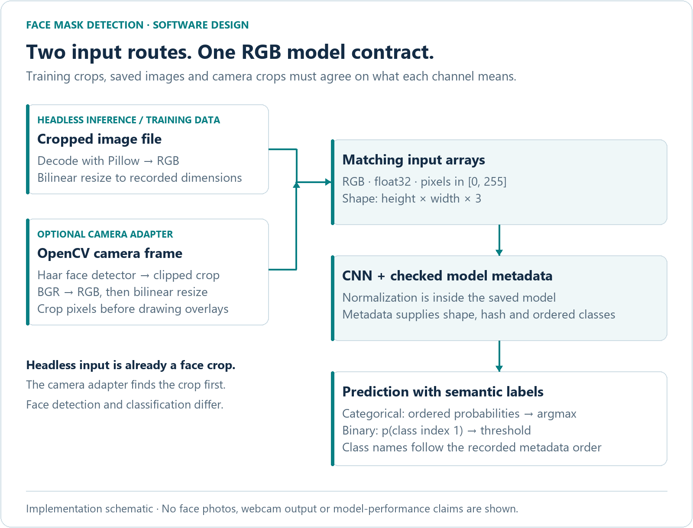
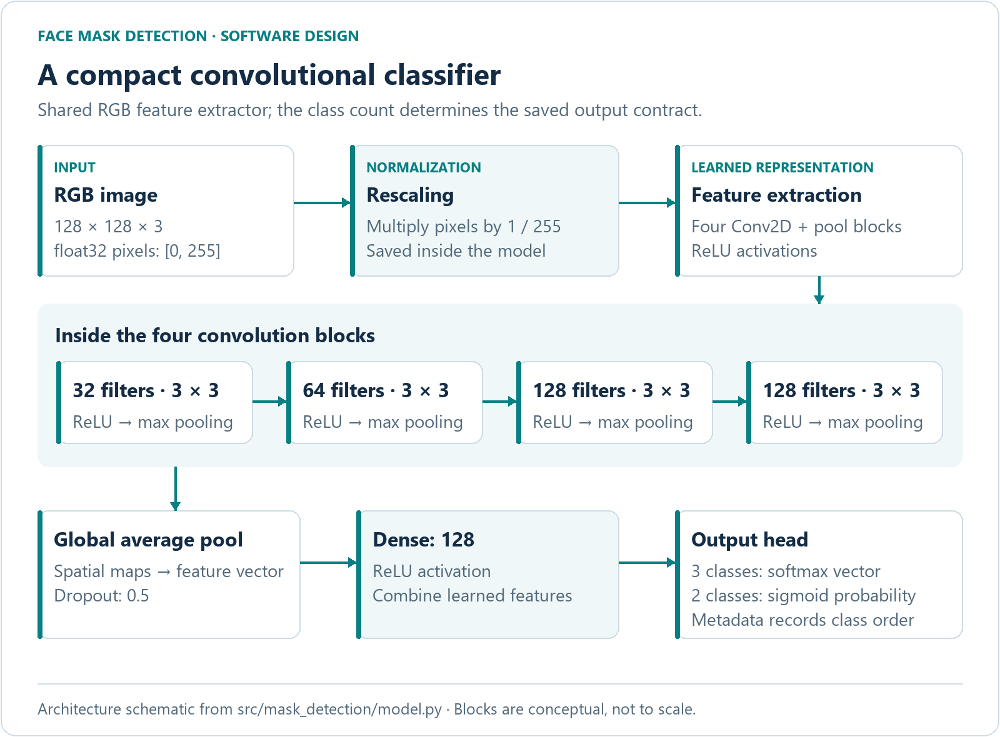

# Face Mask Detection

**A Python computer-vision project connecting CNN training, image inference and an optional OpenCV camera interface.**

I started this project during the COVID-19 period to explore how a model could classify face images using public/Kaggle data. It brought together two different tasks: finding a face in a frame, then classifying the resulting crop.

The original project received a **Commendation at the 2022 Coding Lab International Coding Competition**.

The maintained implementation makes that connection explicit. It uses a shared RGB input contract, saves class meanings with each model, supports camera-free prediction and produces traceable evaluation reports. It is a practical exploration of the details that make a computer-vision pipeline dependable beyond the training script.

**Python · TensorFlow / Keras · OpenCV · CNNs · image preprocessing · model evaluation**

[See the input pipeline](#one-input-contract) · [Explore the CNN](#inside-the-classifier) · [Run the checks](#try-it-without-a-dataset-or-camera) · [Train and predict](#train-and-predict) · [CI runs](https://github.com/IGoByLotsOfNames/face-mask-detection/actions/workflows/python.yml)

## One input contract



*Software schematic, not a camera demonstration. The headless command accepts an already cropped face; the camera adapter detects and crops faces first.*

A colour image can look correct on screen while still being wrong for a model: OpenCV camera frames use **BGR**, while the training path uses **RGB**. Here, both routes end in the same channel order, bilinear resizing and `float32` pixel range. A regression test verifies that an RGB file and its equivalent BGR frame produce identical model inputs.

## Engineering decisions worth exploring

| Decision | Why it matters | Implementation |
|---|---|---|
| Share the input contract across training, files and camera crops | Avoid a silent channel-order difference at inference time | [Data loading](src/mask_detection/data.py) and [inference](src/mask_detection/inference.py) |
| Save class order, preprocessing and a model hash | A binary output must map to the right semantic label and model | [Model artifacts](src/mask_detection/artifacts.py) |
| Group related images before splitting | Repeated faces, source images and their derivatives should not leak across partitions | [Dataset preparation](src/mask_detection/data.py) |
| Separate the camera adapter from the predictor | Core behaviour can be tested without hardware; an image can be classified without opening a camera | [Predictor](src/mask_detection/inference.py) and [camera adapter](src/mask_detection/webcam.py) |
| Preserve clean inference pixels before drawing overlays | A box drawn for one face must not alter another overlapping crop | [Camera implementation](src/mask_detection/webcam.py) and [regression tests](tests/test_inference.py) |
| Release camera resources even on errors | Stream termination, invalid cascades and inference exceptions all need cleanup | [Camera lifecycle](src/mask_detection/webcam.py) |

The classifier is **binary**. Sorted dataset directory names define class indices, and metadata preserves their meanings; the code does not silently assume `mask/no_mask` or `correct/incorrect`. It cannot represent three categories with a single binary output.

## Inside the classifier



*Architecture from [model.py](src/mask_detection/model.py). Blocks are conceptual and not to scale. [Regenerate the diagrams](docs/visuals/render.py) with Pillow.*

The model keeps normalization inside the saved artifact. Its sigmoid output is the probability of the metadata's **class index 1**. The predictor returns the recorded class name, class index, probability of class 1, probability of the predicted class and a fixed `0.5` threshold. These probabilities are model outputs, not calibrated confidence guarantees.

## Try it without a dataset or camera

Use **Python 3.12**, the tested runtime. The core suite requires only NumPy/Pillow:

```bash
python -m venv .venv
# Windows: .venv\Scripts\activate
# macOS/Linux: source .venv/bin/activate
python -m pip install -e .
python -m unittest discover -s tests -v
```

To run the optional test using actual CPU TensorFlow:

```bash
python -m pip install -r requirements-runtime.txt
# PowerShell: $env:RUN_ML_TESTS="1"; $env:TF_ENABLE_ONEDNN_OPTS="0"
# macOS/Linux: export RUN_ML_TESTS=1 TF_ENABLE_ONEDNN_OPTS=0
python -m unittest discover -s tests -v
```

The suite contains **27 core tests and one optional runtime integration test**. The integration test generates colour fixtures, trains for two epochs, saves/reloads the CNN, runs headless inference and writes temporary evaluation results. Camera tests use fake devices to exercise failure paths and cleanup.

| Software property | Evidence in the tests |
|---|---|
| Input consistency | Equivalent RGB image and BGR frame yield the same resized arrays |
| Model identity and semantics | Metadata/model tampering and incompatible input shapes are rejected |
| Split integrity | Grouped duplicates, conflicting labels, changed inputs and immutable destinations are checked |
| Metric correctness | Known confusion matrices, invalid/undefined cases and independent pairwise-AUC comparisons |
| Full runtime path | Actual TensorFlow training, serialization, prediction and evaluation |
| Camera isolation | Cleanup paths and overlapping detections tested without a real camera |

See the [validation record](docs/validation.md) for the environment and observed checks, and [GitHub Actions](https://github.com/IGoByLotsOfNames/face-mask-detection/actions/workflows/python.yml) for current remote runs. No weights or face images are downloaded by the tests. **These are software checks, not measurements of mask-classification accuracy.**

## Train and predict

No dataset or trained model is included. The precise historical dataset version and licence remain unverified. Before retraining, confirm use rights, document what the two classes mean and prepare source-image/person groups appropriate to the study.

```text
dataset/
├── class_a/
│   └── image001.png
└── class_b/
    └── image002.png
```

Provide a CSV with `path,group` columns covering every image. Related crops/augmentations and repeated images of the same person, where applicable to the study, need the same opaque group. At least three independent components per class are required.

```bash
# 1. Freeze a grouped train / validation / test split
python -m mask_detection.data dataset split-data --groups groups.csv --seed 42

# 2. Train using train + validation only
python -m mask_detection.train split-data --epochs 30 --output artifacts/mask.keras

# 3. Evaluate the reserved test partition
python -m mask_detection.evaluate artifacts/mask.keras split-data --output artifacts/test-report.json

# 4. Classify an already cropped image without opening a camera
python -m mask_detection.inference artifacts/mask.keras path/to/face-crop.png
```

Keep `mask.keras` and `mask.metadata.json` together. Evaluation checks their compatibility with the recorded split and exports sample identities, probabilities, a labelled confusion matrix, precision/recall/F1, probability ROC AUC, Brier score and log loss. Reports are written to new paths rather than silently replacing an earlier experiment.

### Optional camera adapter

After producing an appropriate model, the interactive adapter uses OpenCV's Haar face detector to find candidate faces, clips the regions to the frame and passes each crop to the same predictor:

```bash
python -m mask_detection.webcam artifacts/mask.keras --device 0
```

Press **Escape** to exit. The display annotates predicted class names and probabilities; it is not a safety or compliance decision. The old `python src/train.py` and `python src/webcam.py` commands remain wrappers around the package.

## Reproducibility and scope

The splitter records class order, group assignments, hashes and a seed in an immutable manifest. Training and evaluation recheck the inputs; model metadata records training/validation hashes, which cannot overlap the test samples. Whole groups make split ratios approximate. Exact hashing detects byte copies; recoded, cropped or augmented copies require explicit grouping.

Choose any evaluation threshold using validation data before final testing. The interactive/headless predictor uses `0.5`. Undefined metrics are `null`. Seeds improve replayability without guaranteeing identical training across hardware and library versions. `--independent-images` is for known-independent examples, such as synthetic fixtures, rather than unknown identity relationships.

The original work used Kaggle images and explored webcam classification. The older scripts and model files are not presented as validated results for this maintained version. Real-camera reliability, accuracy, calibration, latency and subgroup performance remain unmeasured. Lighting, pose, crop quality and mask style can affect classification; face detection may fail before the classifier receives a crop.

This is a **learning project**, not a safety, identity or compliance system. Raw images, personal identifiers, group manifests and model artifacts remain outside Git. The [MIT licence](LICENSE) covers the code; data and model rights must be assessed separately.
